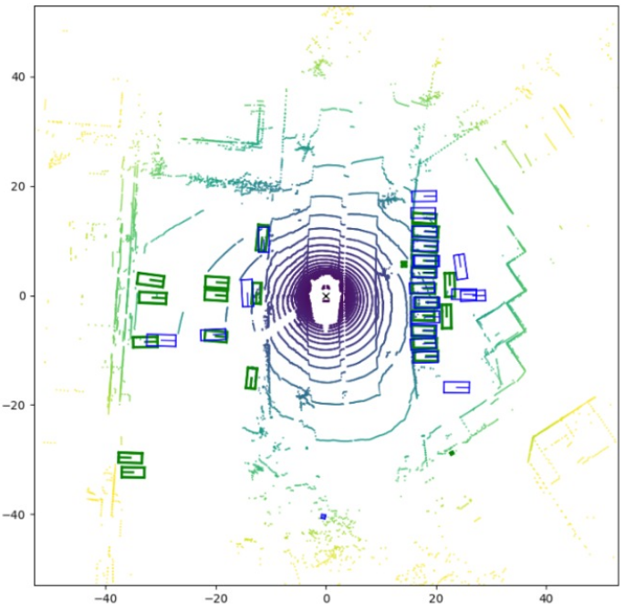
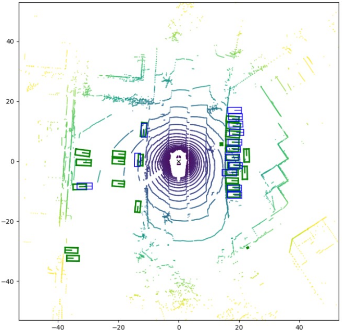
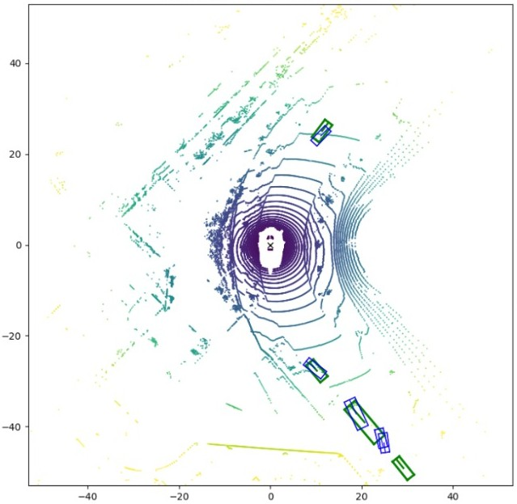
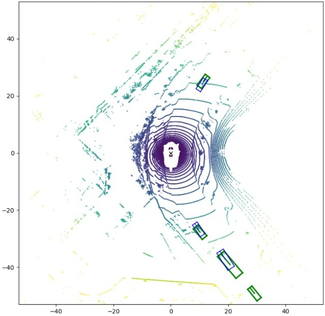
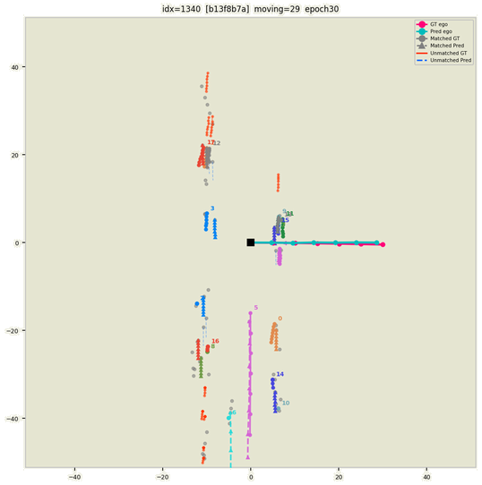
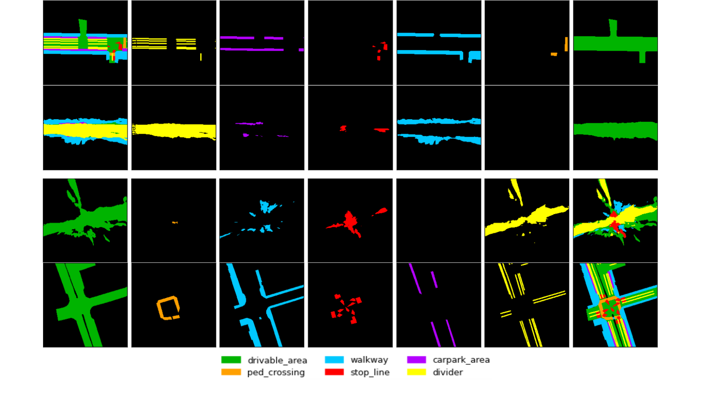
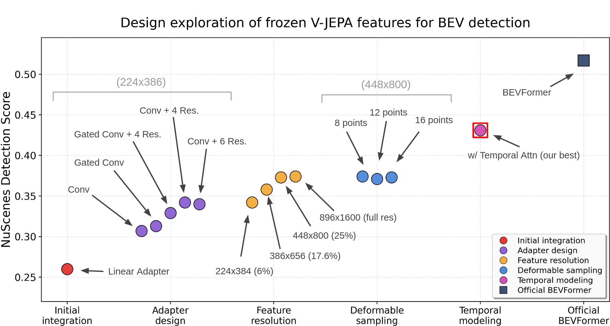

# V-JEPA-BEV: Multi-Task BEV Perception with Frozen Self-Supervised Video Features

**EPFL CS-503 Visual Intelligence · Spring 2026**

[Masa Duric](https://people.epfl.ch/) · [Nathan Phan Tuan Linh](https://www.linkedin.com/in/nathan-phan-tuan-linh/) · [Paul Bourgois](https://people.epfl.ch/) · [Tancrède Lamort de Gail](https://people.epfl.ch/)

[](https://masadj415.github.io/BEVFormer/)
[](https://github.com/masadj415/BEVFormer)
[](https://www.nuscenes.org/)

---

## Abstract

Bird's-Eye-View (BEV) is the dominant scene representation in autonomous driving, providing a unified top-down framework for detection, segmentation, tracking, and planning from a single shared feature map. Its quality is fundamentally bottlenecked by the image backbone, but it has been unclear what *kind* of backbone matters most: one that understands video dynamics, or one with strong static spatial grounding.

We propose **V-JEPA-BEV**: a BEV pipeline driven by a frozen self-supervised backbone, paired with a convolutional adapter (Conv + residual blocks) and BEVFormer's deformable cross-attention. We run a staged ablation through adapter design, input resolution, deformable-sampling density, and temporal BEV fusion, and use it to compare two frozen backbones head-to-head — **V-JEPA 2.1** (temporal) and **DINOv3** (spatial) — across detection, map segmentation, tracking, and ego-trajectory.

On nuScenes, our best V-JEPA configuration reaches **0.431 NDS** and our best DINOv3 configuration reaches **0.466 NDS**, both at **~230 ms/sample** — less than half the 530 ms latency of the BEVFormer reference (R101-DCN, 0.517 NDS). Three key takeaways:

1. **Spatial pretraining matters more than video-level temporal pretraining** for BEV projection.
2. **BEV-level temporal attention is non-negotiable** — removing it collapses DINOv3 from 0.466 to 0.286 NDS, with mAVE rising from 0.461 to 1.109.
3. **Multi-task gradient conflict** between 3D detection and map segmentation is real — task compatibility, not task count, determines whether auxiliary supervision helps or hurts.

---

## Pipeline

<p align="center">
  
  <br>
  <em>Figure 1. A frozen ViT-B backbone (V-JEPA 2.1 or DINOv3) encodes each of the six surround cameras independently. A multi-scale convolutional adapter bridges the backbone tokens to BEVFormer-style feature maps. The BEV transformer lifts them into a shared 200×200 BEV feature map via deformable spatial cross-attention and temporal self-attention. Four task heads read from this shared map.</em>
</p>

The standard BEVFormer pipeline:
```text
multi-camera images → CNN/FPN backbone → BEVFormer encoder/decoder → 3D boxes
```

This project replaces the ResNet backbone with **cached frozen SSL features**:
```text
cached V-JEPA / DINOv3 HDF5 features
  → temporal reduction (last / mean / gated)     [V-JEPA only]
  → multi-scale convolutional adapter
  → BEVFormer spatial cross-attention + temporal BEV self-attention
  → detection / ego-trajectory / tracking / map heads
```

The cached-feature setup lets us iterate on adapter and BEV-transformer design without re-running the backbone, and it is the primary source of the 2.3× inference speedup over BEVFormer R101-DCN.

---

## Qualitative Results

<p align="center">
  <a href="assets/dino.mp4">
    
  </a>
  <br>
  <em>DINOv3-BEV predictions on a nuScenes validation scene (click for full video)</em>
</p>

<p align="center">
  <a href="assets/vjepa.mp4">
    
  </a>
  <br>
  <em>V-JEPA-BEV predictions on the same scene (click for full video)</em>
</p>

### BEV map comparisons

| DINOv3-BEV | BEVFormer reference |
|:-----------:|:-------------------:|
|  |  |

| V-JEPA-BEV | BEVFormer reference |
|:-----------:|:-------------------:|
|  |  |

### Multi-task outputs

| Detection + ego trajectory | HD map segmentation |
|:--------------------------:|:-------------------:|
|  |  |

---

## Main Contributions

**(i)** A **staged ablation** of frozen V-JEPA features through five adapter variants, four input resolutions, three deformable-sampling densities, and BEV temporal fusion, starting from 0.261 NDS and reaching 0.431 NDS.

**(ii)** A **controlled V-JEPA vs DINOv3 comparison** under matched compute — same adapter, BEV transformer, task heads, optimiser, and schedule — with matched ViT-B hidden width.

**(iii)** An **efficiency analysis** showing both backbones run at ~230 ms/sample, a 2.3× speedup over BEVFormer R101-DCN at competitive NDS.

**(iv)** A **multi-task interference analysis** identifying gradient conflict between 3D detection and map segmentation as the bottleneck (not task count).

---

## Methodology

### Frozen backbones

| Backbone | Training | Temporal signal | Token grid (448×800) |
|---|---|---|---|
| **V-JEPA 2.1 ViT-B** | Video JEPA (clip-level) | Yes — T slices per camera | `[6, T·28·50, 768]` |
| **DINOv3 ViT-B** | Image self-distillation | No | `[6, 28·50, 768]` |

Both backbones are kept **frozen end-to-end** throughout all experiments.

### Adapter variants (ablation)

| # | Adapter | NDS |
|---|---|---:|
| 1 | Linear projection | 0.261 |
| 2 | Plain conv (3×3 + BN + ReLU) | — |
| 3 | Gated conv | — |
| **4** | **Conv + 4 Res blocks (hidden 512)** | **0.344** |
| 5 | Conv + 6 Res blocks | marginal gain |

### Staged ablation path

```
Linear adapter (0.261)
  → Conv + 4 Res adapter        (+0.083 NDS → 0.344)
  → 448×800 input resolution    (+0.031 NDS → 0.375)
  → BEV temporal attention      (+0.056 NDS → 0.431)   ← V-JEPA best
  → DINOv3 backbone swap        (+0.035 NDS → 0.466)   ← DINOv3 best
```

### Temporal reduction (V-JEPA only)

| Mode | Description |
|---|---|
| `last` | Use only the last temporal slice |
| `mean` | Average all T slices |
| `gated` | Learned per-channel gate combining current and previous slices |

---

## Validation Results

<p align="center">
  
  <br>
  <em>Figure 2. Quality-latency frontier across all V-JEPA-BEV and DINOv3 variants.</em>
</p>

| Configuration | NDS ↑ | mAP ↑ | mATE ↓ | mAOE ↓ | mAVE ↓ | Latency (ms) |
|---|---:|---:|---:|---:|---:|---:|
| BEVFormer R101-DCN (reference, end-to-end) | **0.517** | — | — | — | — | ~530 |
| **V-JEPA ablation** | | | | | | |
| Linear adapter | 0.261 | — | — | — | — | ~230 |
| + Conv + 4 Res adapter | 0.344 | — | — | — | — | ~230 |
| + 448×800 resolution | 0.375 | — | — | — | 0.663 | ~230 |
| **+ BEV temporal attention (V-JEPA best)** | **0.431** | — | — | — | — | ~230 |
| **DINOv3** | | | | | | |
| DINOv3 + adapter, no BEV temporal | 0.286 | 0.191 | 0.931 | 0.606 | 1.109 | ~230 |
| **DINOv3 + BEV temporal attention (DINOv3 best)** | **0.466** | — | — | 0.445 | 0.461 | ~230 |
| **Multi-task (V-JEPA + BEV temporal)** | | | | | | |
| Det + Tracking + Ego-trajectory | 0.405 | — | — | — | — | ~230 |
| Det + Map segmentation | 0.360 | — | — | — | — | ~230 |
| All 4 tasks (epoch 6, ongoing) | 0.290* | — | — | — | — | ~230 |

*\* 4-task result at epoch 6 — training not yet converged; treat as lower bound.*

### Key finding: BEV temporal attention is critical

Removing temporal attention from **DINOv3** causes an 18-point NDS collapse (0.466 → 0.286):

| | With BEV temporal | Without BEV temporal |
|---|---:|---:|
| NDS | **0.466** | 0.286 |
| mAVE | **0.461** | 1.109 |
| mAOE | **0.445** | 0.606 |

V-JEPA is partially robust (mAVE 0.663 without temporal vs 1.109 for DINOv3), confirming that V-JEPA's video pretraining embeds some velocity signal — but not enough to compensate entirely. **BEV-level temporal reasoning is not optional for camera-only 3D perception.**

---

## Repository Structure

```text
.
├── projects/
│   ├── configs/bevformer/              # V-JEPA, DINO, baseline, and multi-head configs
│   └── mmdet3d_plugin/
│       ├── bevformer/detectors/        # BEVFormerVJepa and BEVFormerDino
│       ├── bevformer/dense_heads/      # detection, ego, motion, and map heads
│       └── datasets/pipelines/         # cached feature and map-mask loading
├── tools/
│   ├── train.py
│   ├── test.py
│   ├── dist_train.sh / dist_test.sh
│   └── analysis_tools/                 # visualization and analysis utilities
├── scripts/                            # cluster/HPC training, evaluation, and caching scripts
├── assets/                             # qualitative figures, GIFs, and video demos
```

Key files:

| File | Purpose |
|---|---|
| `projects/mmdet3d_plugin/bevformer/detectors/bevformer_vjepa.py` | BEVFormer variant consuming cached V-JEPA features |
| `projects/mmdet3d_plugin/bevformer/detectors/bevformer_dino.py` | BEVFormer variant consuming cached DINOv3 features |
| `projects/mmdet3d_plugin/datasets/pipelines/loading_vjepa.py` | HDF5 feature loader, camera alignment, geometry scaling |
| `projects/mmdet3d_plugin/datasets/pipelines/formatting_vjepa.py` | Formatter for cached feature tensors and extra targets |
| `projects/mmdet3d_plugin/bevformer/dense_heads/ego_trajectory_head.py` | Future ego trajectory head |
| `projects/mmdet3d_plugin/bevformer/dense_heads/motion_head.py` | Agent motion prediction head |
| `projects/mmdet3d_plugin/bevformer/dense_heads/map_seg_head.py` | BEV HD-map segmentation head |
| `projects/configs/bevformer/` | Main experiment configurations |

---

## Cached Feature Format

Features are pre-extracted and saved as HDF5 files. Expected layout:

```text
<feature_file>.h5
└── vitb/
    ├── <sample_token_1> → float16 array [6, num_tokens, 768]
    ├── <sample_token_2> → float16 array [6, num_tokens, 768]
    └── ...
```

The first dimension corresponds to the six nuScenes cameras in a fixed cached order, which the loader realigns to match BEVFormer's camera matrix ordering:

```python
CAM_FRONT, CAM_FRONT_LEFT, CAM_FRONT_RIGHT,
CAM_BACK, CAM_BACK_LEFT, CAM_BACK_RIGHT
```

Token grids used in experiments:

| Encoder | Resolution | Token grid | Tensor per sample |
|---|---:|---:|---:|
| V-JEPA | 224×384 | 14×24 | `[6, T·14·24, 768]` |
| V-JEPA | 368×656 | 23×41 | `[6, T·23·41, 768]` |
| V-JEPA | 448×800 | 28×50 | `[6, T·28·50, 768]` |
| DINO | 368×640 | 23×40 | `[6, 23·40, 768]` |
| DINO | 448×800 | 28×50 | `[6, 28·50, 768]` |
| DINO | 896×1600 | 56×100 | `[6, 56·100, 768]` |

For V-JEPA, `T` is the number of temporal slices. The model supports `last`, `mean`, and `gated` temporal reduction (`gated` requires at least two slices).

---

## Installation

```bash
conda create -n bevformer python=3.8 -y
conda activate bevformer

pip install torch==1.9.1+cu111 torchvision==0.10.1+cu111 torchaudio==0.9.1 \
  -f https://download.pytorch.org/whl/torch_stable.html

pip install mmcv-full==1.4.0
pip install mmdet==2.14.0
pip install mmsegmentation==0.14.1

git clone https://github.com/open-mmlab/mmdetection3d.git
cd mmdetection3d
git checkout v0.17.1
python setup.py install
cd ..

pip install einops fvcore iopath==0.1.9 timm==0.6.13 numpy==1.19.5 \
  matplotlib==3.5.2 pandas==1.4.4 scikit-image==0.19.3 setuptools==59.5.0
```

---

## Data Preparation

Prepare the nuScenes dataset following the original BEVFormer instructions:

```bash
python tools/create_data.py nuscenes \
  --root-path ./data/nuscenes \
  --out-dir ./data/nuscenes \
  --extra-tag nuscenes \
  --version v1.0 \
  --canbus ./data
```

Expected directory structure:

```text
data/
├── can_bus/
└── nuscenes/
    ├── maps/
    ├── samples/
    ├── sweeps/
    ├── v1.0-trainval/
    ├── nuscenes_infos_temporal_train.pkl
    └── nuscenes_infos_temporal_val.pkl
```

For multi-task experiments with map and motion targets, augmented annotation files are expected:
```text
nuscenes_infos_temporal_train_with_map_200_motion.pkl
nuscenes_infos_temporal_val_with_map_200_motion.pkl
```

**Caching backbone features:**

1. Configure resolution (must be divisible by patch size) and batch size in `scripts/cache_nuscenes_{vjepa,dino}.py`
2. Submit to SLURM: `sbatch cache_nuscenes_{vjepa,dino}.sh`

This generates the `.h5` file used for training.

---

## Training

Generic distributed training:

```bash
python -m torch.distributed.launch \
  --nproc_per_node=4 \
  tools/train.py \
  projects/configs/bevformer/<CONFIG>.py \
  --launcher pytorch \
  --work-dir work_dirs/<RUN_NAME>
```

Example — DINO 448×800 detection model:

```bash
python -m torch.distributed.launch \
  --nproc_per_node=4 \
  tools/train.py \
  projects/configs/bevformer/bevformer_dino_448x800_bev200_q1_last_adapt4x512_8pts_bs4.py \
  --launcher pytorch \
  --work-dir work_dirs/bevformer_dino_448x800
```

See `scripts/` for cluster/HPC training scripts.

**Evaluation:**

```bash
python -m torch.distributed.launch \
  --nproc_per_node=1 \
  tools/test.py \
  projects/configs/bevformer/<CONFIG>.py \
  work_dirs/<RUN_NAME>/epoch_<N>.pth \
  --launcher pytorch \
  --eval bbox
```

Primary metrics: NDS, mAP, mATE, mASE, mAOE, mAVE, mAAE. If ego or motion heads are enabled, also reports `ego/ADE`, `ego/FDE`, `motion/ADE`, `motion/FDE`.

---

## Main Experiment Configs

| Config | Description |
|---|---|
| `bevformer_dino_448x800_bev200_q1_last_adapt4x512_8pts_bs4.py` | DINOv3 features, 448×800, detection |
| `bevformer_dino_448x800_bev200_q4_allheads_groupdetr11_8pts_bs4.py` | DINOv3 with all heads + Group-DETR queries |
| `bevformer_vjepa_448x800_bev200_q1_last_adapt4x512_8pts_bs4.py` | V-JEPA, last-slice, 448×800 |
| `bevformer_vjepa_448x800_bev200_q1_last_adapt6x512_8pts_bs4.py` | V-JEPA with deeper adapter |
| `bevformer_vjepa_224x384_bev200_q1_gated_adapter512_8pts_bs8.py` | V-JEPA, 224×384, gated temporal fusion |
| `bevformer_vjepa_448x800_bev200_q4_last_adapt4x512_motion_ego_8pts_bs4.py` | V-JEPA + detection + ego + motion |

---

## References

[1] Li, Z. et al. *BEVFormer: Learning Bird's-Eye-View Representation from Multi-Camera Images via Spatiotemporal Transformers.* ECCV 2022.

[2] Oquab, M. et al. *DINOv2: Learning Robust Visual Features without Supervision.* TMLR 2024.

[3] Assran, M. et al. *V-JEPA: Revisiting Feature Prediction for Learning Visual Representations from Video.* arXiv:2404.08471, 2024.

[4] Yang, C. et al. *BEVFormer v2: Adapting Modern Image Backbones to Bird's-Eye-View Recognition via Perspective Supervision.* arXiv:2211.10439, 2022.

[5] Philion, J. and Fidler, S. *Lift, Splat, Shoot.* ECCV 2020.

[6] Liu, Z. et al. *BEVFusion: Multi-Task Multi-Sensor Fusion with Unified Bird's-Eye View Representation.* ICRA 2023.

[7] Caron, M. et al. *Emerging Properties in Self-Supervised Vision Transformers.* ICCV 2021.

[8] Zhu, X. et al. *Deformable DETR.* ICLR 2021.

[9] Yu, T. et al. *Gradient Surgery for Multi-Task Learning.* NeurIPS 2020.

[10] Caesar, H. et al. *nuScenes: A Multimodal Dataset for Autonomous Driving.* CVPR 2020.

---

## Citation

If you use the BEVFormer backbone or codebase, please cite the original paper:

```bibtex
@article{li2022bevformer,
  title={BEVFormer: Learning Bird's-Eye-View Representation from Multi-Camera Images via Spatiotemporal Transformers},
  author={Li, Zhiqi and Wang, Wenhai and Li, Hongyang and Xie, Enze and Sima, Chonghao and Lu, Tong and Qiao, Yu and Dai, Jifeng},
  journal={arXiv preprint arXiv:2203.17270},
  year={2022}
}
```
