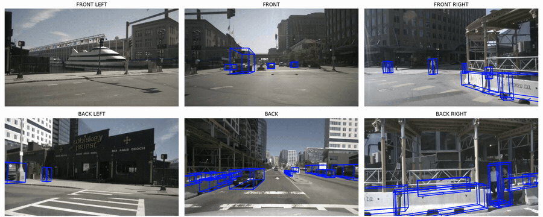
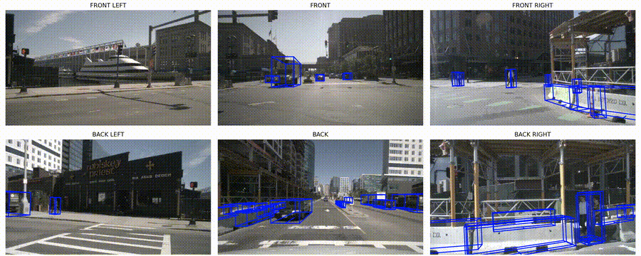
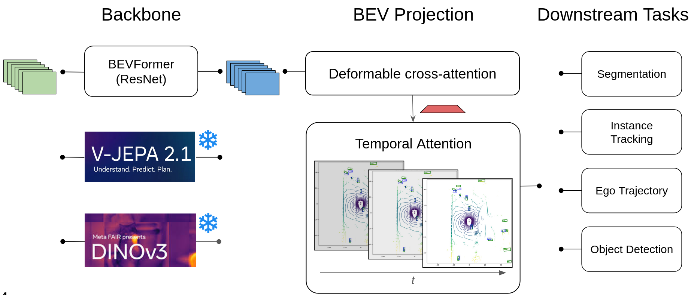

# BEVFormer with Cached V-JEPA and DINO Features

<p align="center">
  <video width="720" controls>
    <source src="assets/vjepa.mp4" type="video/mp4">
  </video>
  <br>
  <em>V-JEPA 2.1</em>
  <br><br>
  <video width="720" controls>
    <source src="assets/dino.mp4" type="video/mp4">
  </video>
  <br>
  <em>DINOv3</em>
</p>

---

This repository is a project fork of **BEVFormer** for camera-only 3D perception on nuScenes. The main idea is to replace the standard ResNet/FPN backbone with **cached frozen self-supervised visual tokens** , comparing **V-JEPA 2.1** (video-temporal) and **DINOv3** (spatial) representations , and study whether these frozen features can be adapted into a BEVFormer-style bird's-eye-view representation via a lightweight convolutional adapter and deformable cross-attention.

The project adds lightweight token-to-BEVFormer adapters and extends the detector with optional multi-task heads for 3D detection, ego trajectory prediction, agent motion prediction, and HD-map segmentation. The cached-feature setup makes it possible to test different frozen backbone representations without repeatedly recomputing dense features during BEVFormer training.

---

<p align="center">
  <a href="assets/dino_scene481_thr035_10s.mp4">
    
  </a>
  <br>
  <em>DINOv3-BEV predictions on a nuScenes validation scene</em>
  <br><br>
  <a href="assets/vjepa_scene481_thr035_10s.mp4">
    
  </a>
  <br>
  <em>V-JEPA-BEV predictions on the same scene</em>
</p>

<!-- ---

## Project overview

Standard BEVFormer uses RGB images as input:

```text
multi-camera images -> CNN/FPN backbone -> BEVFormer encoder/decoder -> 3D boxes
```

This project replaces the ResNet backbone with cached token features:

```text
cached V-JEPA / DINO HDF5 features
        -> camera-order alignment + geometry scaling
        -> temporal slice reduction / gated temporal fusion
        -> adapter
        -> BEVFormer spatial cross-attention + temporal BEV reasoning
        -> detection / trajectory / motion / map heads
```

The cached-feature setup makes it possible to test different frozen representation backbones without repeatedly recomputing dense features during BEVFormer training.

--- -->

## Pipeline

<p align="center">
  
  <br>
  <em>Figure 1. A frozen ViT-B backbone (V-JEPA 2.1 or DINOv3) encodes each of the six surround cameras independently. A multi-scale convolutional adapter bridges the backbone tokens to BEVFormer-style feature maps. The BEV transformer lifts them into a shared 200×200 BEV feature map via deformable spatial cross-attention and temporal self-attention. Four task heads read from this shared map.</em>
</p>

The standard BEVFormer pipeline:
```text
multi-camera images → CNN/FPN backbone → BEVFormer encoder/decoder → 3D boxes
```

This project replaces the ResNet backbone with **cached frozen SSL features**:
```text
cached V-JEPA / DINOv3 HDF5 features
  → temporal reduction (last / mean / gated)     [V-JEPA only]
  → multi-scale convolutional adapter
  → BEVFormer spatial cross-attention + temporal BEV self-attention
  → detection / ego-trajectory / tracking / map heads
```

The cached-feature setup lets us iterate on adapter and BEV-transformer design without re-running the backbone, and it is the primary source of the 2.3× inference speedup over BEVFormer R101-DCN.

## Repository structure

```text
.
├── projects/
│   ├── configs/bevformer/              # V-JEPA, DINO, baseline, and multi-head configs
│   └── mmdet3d_plugin/
│       ├── bevformer/detectors/        # BEVFormerVJepa and BEVFormerDino
│       ├── bevformer/dense_heads/      # detection, ego, motion, and map heads
│       └── datasets/pipelines/         # cached feature and map-mask loading
├── tools/
│   ├── train.py
│   ├── test.py
│   ├── dist_train.sh / dist_test.sh
│   └── analysis_tools/                 # visualization and analysis utilities
├── scripts/                            # cluster/HPC training, evaluation, and caching scripts
├── assets/                             # qualitative figures, GIFs, and video demos
```

Important project files:

| File | Purpose |
|---|---|
| `projects/mmdet3d_plugin/bevformer/detectors/bevformer_vjepa.py` | BEVFormer variant consuming cached V-JEPA features |
| `projects/mmdet3d_plugin/bevformer/detectors/bevformer_dino.py` | BEVFormer variant consuming cached DINOv3 features |
| `projects/mmdet3d_plugin/datasets/pipelines/loading_vjepa.py` | HDF5 feature loader, camera alignment, geometry scaling |
| `projects/mmdet3d_plugin/datasets/pipelines/formatting_vjepa.py` | Formatter for cached feature tensors and extra targets |
| `projects/mmdet3d_plugin/bevformer/dense_heads/ego_trajectory_head.py` | Future ego trajectory head |
| `projects/mmdet3d_plugin/bevformer/dense_heads/motion_head.py` | Agent motion prediction head |
| `projects/mmdet3d_plugin/bevformer/dense_heads/map_seg_head.py` | BEV HD-map segmentation head |
| `projects/configs/bevformer/` | Main experiment configurations |

## Cached feature format

Features are pre-extracted and saved as HDF5 files. Expected layout:

```text
<feature_file>.h5
└── vitb/
    ├── <sample_token_1> → float16 array [6, num_tokens, 768]
    ├── <sample_token_2> → float16 array [6, num_tokens, 768]
    └── ...
```

The first dimension corresponds to the six nuScenes cameras in a fixed cached order, which the loader realigns to match BEVFormer's camera matrix ordering:

```python
CAM_FRONT, CAM_FRONT_LEFT, CAM_FRONT_RIGHT,
CAM_BACK, CAM_BACK_LEFT, CAM_BACK_RIGHT
```

Token grids used in experiments:

| Encoder | Resolution | Token grid | Tensor per sample |
|---|---:|---:|---:|
| V-JEPA | 224×384 | 14×24 | `[6, T·14·24, 768]` |
| V-JEPA | 368×656 | 23×41 | `[6, T·23·41, 768]` |
| V-JEPA | 448×800 | 28×50 | `[6, T·28·50, 768]` |
| DINO | 368×640 | 23×40 | `[6, 23·40, 768]` |
| DINO | 448×800 | 28×50 | `[6, 28·50, 768]` |
| DINO | 896×1600 | 56×100 | `[6, 56·100, 768]` |

For V-JEPA, `T` is the number of temporal slices. The model supports `last`, `mean`, and `gated` temporal reduction (`gated` requires at least two slices).

## Installation

```bash
conda create -n bevformer python=3.8 -y
conda activate bevformer

pip install torch==1.9.1+cu111 torchvision==0.10.1+cu111 torchaudio==0.9.1 \
  -f https://download.pytorch.org/whl/torch_stable.html

pip install mmcv-full==1.4.0
pip install mmdet==2.14.0
pip install mmsegmentation==0.14.1

# mmdetection3d version used by the original BEVFormer codebase
git clone https://github.com/open-mmlab/mmdetection3d.git
cd mmdetection3d
git checkout v0.17.1
python setup.py install
cd ..

pip install einops fvcore iopath==0.1.9 timm==0.6.13 numpy==1.19.5 \
  matplotlib==3.5.2 pandas==1.4.4 scikit-image==0.19.3 setuptools==59.5.0
```

## Data preparation

Prepare the nuScenes dataset following the original BEVFormer instructions:

```bash
python tools/create_data.py nuscenes \
  --root-path ./data/nuscenes \
  --out-dir ./data/nuscenes \
  --extra-tag nuscenes \
  --version v1.0 \
  --canbus ./data
```

Expected directory structure:

```text
data/
├── can_bus/
└── nuscenes/
    ├── maps/
    ├── samples/
    ├── sweeps/
    ├── v1.0-trainval/
    ├── nuscenes_infos_temporal_train.pkl
    └── nuscenes_infos_temporal_val.pkl
```

For multi-task experiments with map and motion targets, augmented annotation files are expected:
```text
nuscenes_infos_temporal_train_with_map_200_motion.pkl
nuscenes_infos_temporal_val_with_map_200_motion.pkl
```

**Caching backbone features:**

1. Configure resolution (must be divisible by patch size) and batch size in `scripts/cache_nuscenes_{vjepa,dino}.py`
2. Submit to SLURM: `sbatch cache_nuscenes_{vjepa,dino}.sh`

This generates the `.h5` file used for training.

## Training

Generic distributed training:

```bash
python -m torch.distributed.launch \
  --nproc_per_node=4 \
  tools/train.py \
  projects/configs/bevformer/<CONFIG>.py \
  --launcher pytorch \
  --work-dir work_dirs/<RUN_NAME>
```

Example : DINO 448×800 detection model:

```bash
python -m torch.distributed.launch \
  --nproc_per_node=4 \
  tools/train.py \
  projects/configs/bevformer/bevformer_dino_448x800_bev200_q1_last_adapt4x512_8pts_bs4.py \
  --launcher pytorch \
  --work-dir work_dirs/bevformer_dino_448x800
```

See `scripts/` for cluster/HPC training scripts.

**Evaluation:**

```bash
python -m torch.distributed.launch \
  --nproc_per_node=1 \
  tools/test.py \
  projects/configs/bevformer/<CONFIG>.py \
  work_dirs/<RUN_NAME>/epoch_<N>.pth \
  --launcher pytorch \
  --eval bbox
```

Primary metrics: NDS, mAP, mATE, mASE, mAOE, mAVE, mAAE. If ego or motion heads are enabled, also reports `ego/ADE`, `ego/FDE`, `motion/ADE`, `motion/FDE`.


## Citation

If you use the BEVFormer backbone or codebase, please cite the original BEVFormer paper:

```bibtex
@article{li2022bevformer,
  title={BEVFormer: Learning Bird's-Eye-View Representation from Multi-Camera Images via Spatiotemporal Transformers},
  author={Li, Zhiqi and Wang, Wenhai and Li, Hongyang and Xie, Enze and Sima, Chonghao and Lu, Tong and Qiao, Yu and Dai, Jifeng},
  journal={arXiv preprint arXiv:2203.17270},
  year={2022}
}
```
